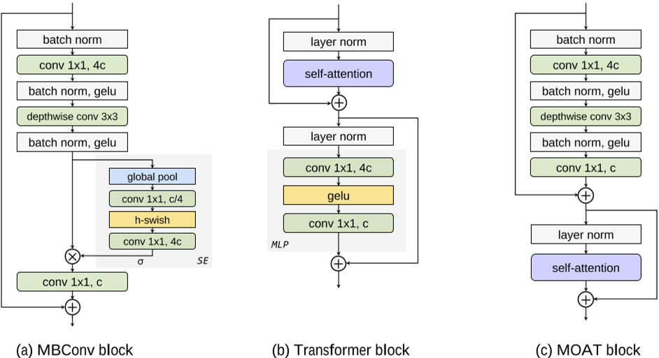
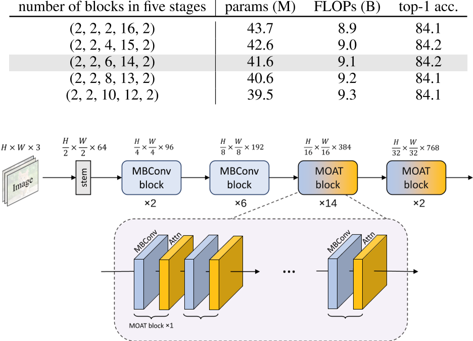

# pytorch-MOAT
论文复现，使用pytorch实现MOAT(未开源)，可以在ImageNet或自己的数据集上训练，支持apex混合精度，中断后自动加载权重训练，各种图像增强技术


The code for MBConv and RelativeSelfAttention comes mainly from ChristophReich1996: https://github.com/ChristophReich1996/MaxViT

Unofficial **PyTorch** reimplementation of the
paper [MOAT: Alternating Mobile Convolution and Attention Brings Strong Vision Models](https://arxiv.org/pdf/2210.01820.pdf)
by ZeChen Wu.

<p align="center">
  
</p>

<p align="center">
  
</p>

Figure taken from [paper](https://arxiv.org/pdf/2210.01820.pdf).


# Install
- Create a conda virtual environment and activate it:

```bash
conda create -n moat python=3.7 -y
conda activate moat
```

- Install `CUDA==10.1` with `cudnn7` following
  the [official installation instructions](https://docs.nvidia.com/cuda/cuda-installation-guide-linux/index.html)
- Install `PyTorch==1.7.1` and `torchvision==0.8.2` with `CUDA==10.1`:

```bash
conda install pytorch==1.7.1 torchvision==0.8.2 cudatoolkit=10.1 -c pytorch
```

- Install `timm`:

```bash
pip install timm
```

- Install `Apex`:

```bash
git clone https://github.com/NVIDIA/apex
cd apex
pip install -v --disable-pip-version-check --no-cache-dir --global-option="--cpp_ext" --global-option="--cuda_ext" ./
```

- Install other requirements:

```bash
pip install opencv-python==4.4.0.46 termcolor==1.1.0 yacs==0.1.8
```

### Data preparation

We use standard ImageNet dataset, you can download it from http://image-net.org/. We provide the following two ways to
load data:

- For standard folder dataset, move validation images to labeled sub-folders. The file structure should look like:
  ```bash
  $ tree data
  imagenet
  ├── train
  │   ├── class1
  │   │   ├── img1.jpeg
  │   │   ├── img2.jpeg
  │   │   └── ...
  │   ├── class2
  │   │   ├── img3.jpeg
  │   │   └── ...
  │   └── ...
  └── val
      ├── class1
      │   ├── img4.jpeg
      │   ├── img5.jpeg
      │   └── ...
      ├── class2
      │   ├── img6.jpeg
      │   └── ...
      └── ...
 
  ```
- To boost the slow speed when reading images from massive small files, we also support zipped ImageNet, which includes
  four files:
    - `train.zip`, `val.zip`: which store the zipped folder for train and validate splits.
    - `train_map.txt`, `val_map.txt`: which store the relative path in the corresponding zip file and ground truth
      label. Make sure the data folder looks like this:

  ```bash
  $ tree data
  data
  └── ImageNet-Zip
      ├── train_map.txt
      ├── train.zip
      ├── val_map.txt
      └── val.zip
  
  $ head -n 5 data/ImageNet-Zip/val_map.txt
  ILSVRC2012_val_00000001.JPEG	65
  ILSVRC2012_val_00000002.JPEG	970
  ILSVRC2012_val_00000003.JPEG	230
  ILSVRC2012_val_00000004.JPEG	809
  ILSVRC2012_val_00000005.JPEG	516
  
  $ head -n 5 data/ImageNet-Zip/train_map.txt
  n01440764/n01440764_10026.JPEG	0
  n01440764/n01440764_10027.JPEG	0
  n01440764/n01440764_10029.JPEG	0
  n01440764/n01440764_10040.JPEG	0
  n01440764/n01440764_10042.JPEG	0
  ```
  
# Train for scratch
```bash
python -m torch.distributed.launch --nproc_per_node <num-of-gpus-to-use> --master_port 12345  main.py \ 
--cfg <config-file> --data-path <imagenet-path> [--batch-size <batch-size-per-gpu> --output <output-directory> --tag <job-tag>]
```

For example, to train `ffc_base` with 8 GPU on a single node for 300 epochs, run:

`moat_0`:

```bash
python -m torch.distributed.launch --nproc_per_node 8 --master_port 12345  main.py \
--cfg configs/moat_0.yaml --data-path <imagenet-path> --batch-size 128
```

`moat_1`:

```bash
python -m torch.distributed.launch --nproc_per_node 8 --master_port 12345  main.py \
--cfg configs/moat_1.yaml --data-path <imagenet-path> --batch-size 128
```

`moat_2`:

```bash
python -m torch.distributed.launch --nproc_per_node 8 --master_port 12345  main.py \
--cfg configs/moat_2.yaml --data-path <imagenet-path> --batch-size 128
```

`moat_3`:

```bash
python -m torch.distributed.launch --nproc_per_node 8 --master_port 12345  main.py \
--cfg configs/moat_3.yaml --data-path <imagenet-path> --batch-size 128 \
--accumulation-steps 2 [--use-checkpoint]
```
